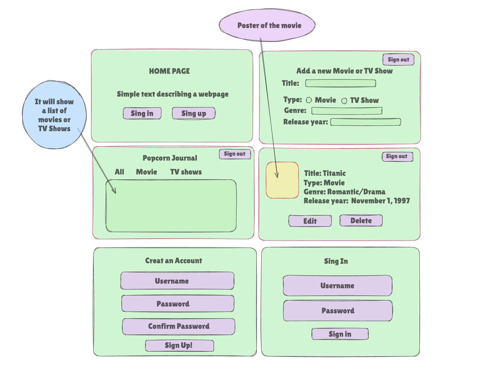
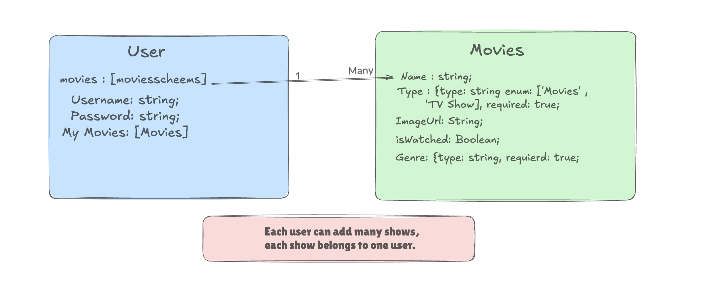

## My app title: ***Popcorn Journal***
is a full-stack CRUD web app that lets users track their favorite ***Movies*** and ***TV Shows***.  
You can add, edit, delete, and review shows in your personal watchlist.

### My goal for this app is to create an app where users can:
- Add movies and TV shows to ther watch list
- Mark them as watched or to watch
- View all ther Movies/TV shows in one dashbord

## Wireframe

## Home Page
- App name and description
- Buttons: Sign In / Sign Up

## Dashboard
- List of all shows with filters
- Columns: Title, Type, Year, Watched

## Buttons:
- Add New
- Save / Cancel

## Form fields: 
- Title, Type, Genre, Release Year, Watched

## Show Details
- Show details + Edit / Delete buttons

## Strech goals
- Reviews sectioc
- Add Review
- Reviews/Cancel

## ERD

